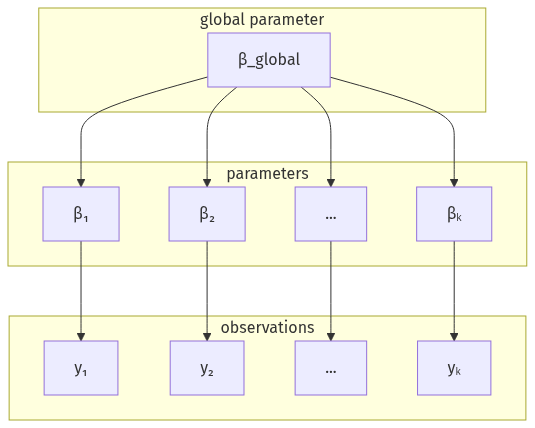

# A bare draft

Plain prose that must read correctly with **no JavaScript at all**. This is the
`--bare` build target: a rough draft to send to someone, a long-term archive, or the
input to a future print pipeline. The smallest, most robust, dependency-free HTML the
tool can emit.

Inline math like $e^{i\pi} + 1 = 0$ is server-rendered (KaTeX → static HTML + CSS), so
it survives a script-free page.

A fenced code block is highlighted on the server, so it stays readable too:

```python
def greet(name):
    return f"hello, {name}"
```



A `{js}` cell is interactive only with its browser runtime; `--bare` drops it (the
output container is left empty) rather than ship a dead `<script>`:

```{js}
return Plot.plot({ marks: [Plot.dot([[0, 0], [1, 1]])] });
```

A Mermaid diagram has no renderer in a bare page, so its source shows as-is:

```{mermaid}
graph TD; A --> B;
```
