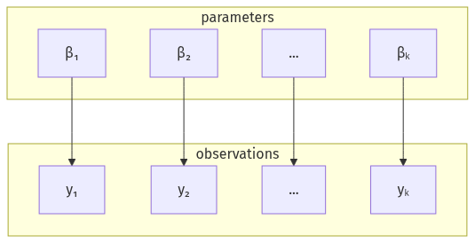
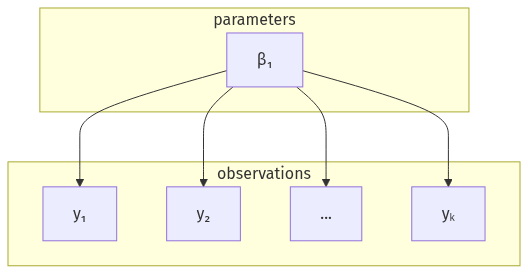

Every figure is click-to-zoom, and a multi-image page becomes a navigable gallery:
open one and step through the rest with the ← / → arrow keys.

::: {layout-ncol=3}
{#fig-no-pooling}

{#fig-complete-pooling}

{#fig-hierarchical}
:::

The three fits above (@fig-no-pooling, @fig-complete-pooling, and @fig-hierarchical)
zoom into one gallery: click any one, then step through the others with ← / →.
