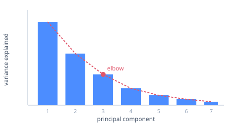

# Overview

**qmd-fast** is a single-purpose Rust dev server that renders `.qmd` files to
HTML (blog posts, reveal.js slides, books) for one author's writing workflow. It
is not a general Quarto replacement. The whole tool is organised around three
load-bearing goals:

- **Click-to-source.** Every rendered block knows exactly where it came from, so
  you can jump from the preview back to the line that produced it.
- **Block-level incremental updates.** Saving a file re-renders only the blocks
  that changed, leaving everything else (including live canvases) untouched.
- **No per-edit startup cost.** A warm server and a warm Jupyter kernel mean
  edits are reflected immediately, with no cold start on every save.

::: {.callout-note}
## Scope

qmd-fast renders to HTML only. There is no PDF path and no format matrix. The
"spec" is a small corpus of real documents under `corpus/`: when those render
correctly, the tool is done.
:::

This page is itself a `.qmd` rendered by qmd-fast, so the
[Feature showcase](#feature-showcase) below is *live*, not a description. Run it
with `serve docs/index.qmd 4321` to see the interactive examples execute.

# Quick start

Render a file to a standalone HTML page:

```sh
cargo run -p qmd-fast-server -- render post.qmd > out.html
```

Or start the live preview server and edit with instant updates:

```sh
cargo run -p qmd-fast-server -- serve post.qmd 4321
```

Then open `http://127.0.0.1:4321`. Save the file and watch only the edited block
update in place, with scroll position preserved.

# Architecture

All of the intelligence lives in the Rust core behind a stable websocket
protocol. The browser preview is a thin client, as @fig-architecture shows.

```{mermaid}
%%| label: fig-architecture
%%| fig-cap: "qmd-fast architecture: thin clients talk to the server over a websocket, and all rendering lives in the Rust core."
flowchart LR
  BR["Browser preview<br/>(vanilla JS)"]
  subgraph Server["qmd-fast server"]
    direction TB
    WS["Websocket<br/>+ file watcher"]
    subgraph Core["qmd-fast-core"]
      direction TB
      P["Parser<br/>comrak + sourcepos"] --> M["Block model<br/>+ diff"] --> R["Render<br/>html / reveal / book"]
    end
    K["Warm Jupyter kernel"]
  end
  F[(".qmd files")]
  BR <-->|JSON protocol| WS
  WS --> P
  R -->|changed blocks| WS
  F -.->|watch| WS
  M -->|code cells| K --> M
```

| Component | Crate / path | Responsibility |
|---|---|---|
| Core | `crates/core` | Parsing (comrak + sourcepos), the block model, HTML rendering |
| Server | `crates/server` | Websocket dev server, file watcher, Jupyter kernel pool |
| Web client | `web-client/` | Browser preview client (vanilla JS) — the client |

The protocol is open, so an embedded editor client (a VS Code extension, etc.) is
a new thin client, not a rewrite. A save flows through the pipeline as
@fig-save-flow shows:

```{mermaid}
%%| label: fig-save-flow
%%| fig-cap: "How a save flows through the pipeline: only the changed blocks are pushed to the preview."
flowchart LR
  save["Save .qmd"] --> watch["File watcher"]
  watch --> parse["Re-parse + block model"]
  parse --> diff["Diff by block id"]
  diff --> ws["Websocket:<br/>changed blocks only"]
  ws --> dom["Preview updates<br/>in place"]
```

# The block model

Every top-level element is a **block**. Each block carries three data
attributes that the rest of the system keys off:

- `data-block-id` is a content hash (with a positional tiebreak for duplicates).
  Because it is content-derived, an unchanged block keeps its id across edits and
  is never touched.
- `data-sourcepos` is the `startLine:startCol-endLine:endCol` range the block
  came from. This is what powers click-to-source in both directions.
- `data-source-file` is present only on blocks pulled in from an
  ``d file, so cross-file source mapping still works.

Source mapping, incremental re-render, and live-state preservation all build on
this one model.

# The websocket protocol

On connect, the server sends a `full_render`; on each save it diffs the new block
list against the old one and broadcasts only the differences.

| Direction | Message | Payload |
|---|---|---|
| server to client | `full_render` | `title`, `body_html` |
| server to client | `update` | `target_id`, `html` |
| server to client | `insert` | `after_id`, `html` |
| server to client | `remove` | `target_id` |
| client to server | `click_block` | `block_id`, `source_file`, `sourcepos` |

Double-clicking a block opens its source in your editor — a
`vscode://file/…:line:col` deep link by default (so it assumes VS Code for now).
The client also speaks a `postMessage` protocol as the integration surface for an
embedded editor client: it posts `qmd-goto` up to a host (which reveals the
source) and accepts `qmd-cursor` to highlight the block under the editor cursor.

# Feature showcase

Everything below is produced from this page's own `.qmd` source. The interactive
Observable examples need a running server (the runtime does not work over
`file://`), and the executable Python examples additionally need a kernel (see
[Code execution](#code-execution)); with `serve` they are fully live.

## Prose and typography

Standard Markdown works as expected: **bold**, *italic*, ~~strikethrough~~,
`inline code`, [links](https://example.com), nested lists, blockquotes, and pipe
tables with per-column alignment:

| Capability | Status | Where |
|:--|:--:|--:|
| Block model + diff | ✅ | `crates/core` |
| Live Observable cells | ✅ | vendored runtime |
| PDF / non-HTML output | ❌ | out of scope |

> Smart typography turns straight quotes into curly ones and handles ellipses…,
> matching the look of the author's existing posts.

Syntax-highlighted code blocks get a hover **Copy** button:

```rust
/// Every rendered block carries a content-hash id and its source range.
struct Block {
    id: String,        // stable across edits while the content is unchanged
    sourcepos: String, // "startLine:startCol-endLine:endCol"
    html: String,
}
```

## Math

Math renders server-side with KaTeX and ships fully offline (the fonts are inlined
at build time). Inline math like $e^{i\pi} + 1 = 0$ sits in running text; display
math stands alone; and a labelled equation is **numbered and cross-referencable**.
The discrete Fourier transform [@cooley1965] is given by @eq-dft:

$$
X[k] = \sum_{n=0}^{N-1} x[n]\, e^{-2\pi i k n / N}
$$ {#eq-dft}

Multi-line aligned environments work too:

$$
\begin{aligned}
  \nabla \cdot \mathbf{E} &= \rho/\varepsilon_0 \\
  \nabla \times \mathbf{B} &= \mu_0\mathbf{J} + \mu_0\varepsilon_0 \frac{\partial \mathbf{E}}{\partial t}
\end{aligned}
$$

## Live interactive content (Observable / OJS)

`{ojs}` cells execute client-side against a vendored Observable runtime: reactive
cells, `viewof` inputs, `Plot`, and `d3` all work, and a cell re-runs automatically
when an input it depends on changes. Drag the slider to add odd harmonics to a
square-wave Fourier synthesis and watch the curve sharpen:

```{ojs}
//| echo: false
viewof harmonics = Inputs.range([1, 12], {value: 3, step: 1, label: "Harmonics"})
```

```{ojs}
//| echo: false
Plot.lineY(
  Array.from({length: 500}, (_, t) =>
    d3.range(1, harmonics + 1).reduce(
      (sum, k) => sum + Math.sin(2 * Math.PI * (2 * k - 1) * t / 500) / (2 * k - 1), 0)),
  {curve: "basis", stroke: "#4c8dff"}
).plot({height: 200, marginLeft: 36, y: {label: "amplitude"}})
```

### The Python → OJS bridge

`ojs_define()` in a Python cell hands values to OJS, so you can compute in Python
and render reactively in the browser. (This part needs a kernel.)

```{python}
#| code-fold: true
#| code-summary: "Python: sample a noisy sine wave"
import math, random
random.seed(7)
signal = [math.sin(2 * math.pi * i / 40) + random.uniform(-0.3, 0.3) for i in range(120)]
ojs_define(signal=signal)
```

```{ojs}
//| echo: false
Plot.plot({
  height: 180, marginLeft: 36,
  marks: [Plot.ruleY([0]), Plot.lineY(signal, {stroke: "#2bb673"})]
})
```

### 3D graphics (Three.js / WebGL)

Because OJS cells can `import` any ES module, **3D visualizations work too**: a
cell pulls Three.js straight from a CDN and returns its `<canvas>`. The cube
below spins on its own (`invalidation` cleans up the animation when the block is
re-rendered). The author's PCA post drives interactive WebGL point clouds the
same way — Python computes the data, `ojs_define` hands it to a Three.js scene.

```{ojs}
//| echo: false
{
  const THREE = await import("https://esm.sh/three@0.163.0");
  const w = 600, h = 320;
  const renderer = new THREE.WebGLRenderer({ antialias: true });
  renderer.setSize(w, h);
  renderer.setPixelRatio(Math.min(window.devicePixelRatio, 2));
  renderer.setClearColor(0x111827, 1);

  const scene = new THREE.Scene();
  const camera = new THREE.PerspectiveCamera(45, w / h, 0.1, 100);
  camera.position.set(3, 2.2, 4);
  camera.lookAt(0, 0, 0);
  scene.add(new THREE.AmbientLight(0xffffff, 0.6));
  const key = new THREE.DirectionalLight(0xffffff, 0.9);
  key.position.set(5, 6, 4);
  scene.add(key);

  const cube = new THREE.Mesh(
    new THREE.BoxGeometry(1.6, 1.6, 1.6),
    new THREE.MeshStandardMaterial({ color: 0x4c8dff, metalness: 0.1, roughness: 0.45 })
  );
  scene.add(cube);
  scene.add(new THREE.AxesHelper(2.2));

  let raf;
  (function animate() {
    raf = requestAnimationFrame(animate);
    cube.rotation.x += 0.010;
    cube.rotation.y += 0.013;
    renderer.render(scene, camera);
  })();
  invalidation.then(() => { cancelAnimationFrame(raf); renderer.dispose(); });

  return renderer.domElement;
}
```

## Code execution

A fenced cell tagged with a language runs against a warm Jupyter kernel; its
outputs become their own blocks tied to the cell's id:

```{python}
#| echo: true
import numpy as np
np.arange(5).sum()
```

On save, only cells whose source changed (plus downstream cells) re-execute, and
the kernel never cold-starts. Point the server at a Python with `ipykernel` via
the `QMD_FAST_PYTHON` environment variable; without one, a cell renders as
highlighted source rather than failing.

### Folded code

`#| code-fold: true` collapses a listing behind a summary (label it with
`code-summary`), so long setup code stays out of the way until clicked:

```{python}
#| code-fold: true
#| code-summary: "Show the setup"
import numpy as np
rng = np.random.default_rng(0)
draws = rng.normal(size=10_000)
round(float(draws.mean()), 3), round(float(draws.std()), 3)
```

## Raw HTML passthrough

A `{=html}` block is emitted verbatim, so you can drop in markup the Markdown
grammar doesn't cover (custom widgets, embeds, audio players):

```{=html}
<div style="display:flex;gap:.6rem;align-items:center;padding:.7rem 1rem;border-radius:10px;
            background:linear-gradient(90deg,#eef2ff,#fce7f3);font:600 14px ui-sans-serif,system-ui">
  <span style="font-size:1.5rem">🔌</span>
  <span>This badge is raw HTML, passed through by a <code>{=html}</code> block, not escaped.</span>
</div>
```

## Figures, captions, and lightbox

A standalone image with a `{#fig-…}` attribute becomes a numbered `<figure>`;
clicking it opens a full-screen lightbox, and `@fig-` cross-references resolve to
its number. As @fig-scree shows, the variance drops off after the third component:

{#fig-scree}

## Callouts

Fenced divs become callouts, layout grids, or generic containers.

::: {.callout-tip}
## Tip

Use a `title=` attribute or a leading heading to label a callout; otherwise it
falls back to the callout kind.
:::

A callout with `collapse="true"` becomes a native, JavaScript-free disclosure:

::: {.callout-note collapse="true"}
## The full block model (click to expand)

Every top-level element carries `data-block-id` (a content hash), `data-sourcepos`
(its source range), and, for included files, `data-source-file`. Source mapping,
incremental re-render, and live-state preservation all build on this one model.
:::

::: {.callout-warning}
Unterminated or empty divs degrade gracefully rather than breaking the page.
:::

## Diagrams

A `{mermaid}` code block renders client-side with mermaid.js, loaded lazily the
first time a diagram appears. The flowcharts in [Architecture](#architecture)
above are rendered exactly this way, and like figures they are **click-to-zoom**:
click a diagram to open it full-screen in the lightbox.

Adding `%%| label: fig-…` and `%%| fig-cap:` turns a diagram into a **numbered,
captioned figure** you can cross-reference, just like an image. As @fig-render
shows, the three output kinds share one pipeline:

```{mermaid}
%%| label: fig-render
%%| fig-cap: "One block model, three render targets."
flowchart LR
  Q[".qmd"] --> BM["block model"]
  BM --> H["HTML page"]
  BM --> R["reveal.js deck"]
  BM --> K["book + TOC"]
```

## Citations and cross-references

With a `bibliography:` in the front matter, `[@key]` citations become numbered
links to an auto-generated References section, formatted from the BibTeX file.
This page cites the *TeXbook* [@knuth1984] and the FFT paper [@cooley1965], and
groups with locators work too: [@knuth1984; @cooley1965, p. 297]. Cross-references
resolve to labelled links across `@fig-`, `@sec-`, `@tbl-`, `@eq-`, `@lst-`,
`@thm-`, and `@def-`, carrying the resolved number when known (as `@eq-dft` and
`@fig-scree` above do).

## Reveal.js slides

A deck is just a different front-matter `format: revealjs`. Headings split the
document into slides, a title slide is generated from the metadata, and block-swap
still works within the current slide so live edits never reset your position.
[`docs/tour.qmd`](tour.qmd) is a runnable example: `serve docs/tour.qmd 4321`.

## Books and a live table of contents

A document with `toc: true` gains a sticky table of contents built from its
heading anchors and rebuilt live as you edit. This very page is the demo: the TOC
beside the content is generated from these headings.

## Themes

`theme:` selects the built-in `light` (default) or `dark`, a `.css`/`.scss` file,
or an installed `_extensions/<name>/` bundle. See [THEMING.md](THEMING.md) for
authoring one; a theme is just a `:root` block of CSS custom properties.

## Click-to-source and editor sync

In the browser preview, single-clicking a block highlights it (and reports it to
the server); double-clicking opens its exact source line in your editor (including
across ``d files) via a `vscode://` deep link — VS Code is assumed
for now. The client still speaks the `qmd-goto`/`qmd-cursor` `postMessage`
protocol, so an embedded editor client can host the preview and add reverse cursor
sync without forking it.

# CLI reference

| Command | Effect |
|---|---|
| `render <file.qmd>` | Render a one-shot full HTML page to stdout |
| `blocks <file.qmd>` | List block ids and sourcepos (for debugging) |
| `serve <file.qmd> [port]` | Run the live preview server (default port 4321) |
